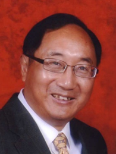

# Keynote Speakers

## **From Scalable Computing to the Scaling Law: A Reexamination of Parallel Processing**

    
    

        <h3 style="margin: 0;"><strong>Xian-He Sun</strong></h3>
        
Illinois Institute of Technology Chicago, USA

    

**Abstract:** AI’s recent success is driven by scaling laws, where increasing data and compute power yields predictably better accuracy. This trend demands computing systems that are infinitely scalable. This talk reevaluates parallel processing through both scale-out and scale-up lenses to address these AI-driven challenges. After reviewing foundational breakthroughs in the field, we present DataflowV (Dataflow under the von Neumann machine), a data-centric methodology that maximizes parallelism and concurrency from different aspects. We illustrate the DataflowV concept using two NSF-funded cyberinfrastructure systems: Hermes, for large-scale data handling, and ChronoLog, for application-specific AI-integrated optimizations. We conclude by introducing IOWrap, a data-management system tailored for the unique demands of modern AI agents.

**Bio:** Dr. **Xian-He Sun** is a University Distinguished Professor, the Ron Hochsprung Endowed Chair of Computer Science, and the director of the Gnosis Research Center for AI-driven data management at the Illinois Institute of Technology (Illinois Tech). Before joining Illinois Tech, he worked at DoE Ames National Laboratory, at ICASE, NASA Langley Research Center, at Louisiana State University, Baton Rouge, and was an ASEE fellow at Navy Research Laboratories. Dr. Sun is an IEEE fellow and is known for his memory-bounded speedup model, also called Sun-Ni’s Law, for scalable computing. His research interests include high-performance data management, memory and I/O systems, and performance evaluation and optimization. He has over 350 publications and 7 patents in these areas and is currently leading multiple large software development projects in high performance data management systems. Dr. Sun is the Editor-in-Chief of the IEEE Transactions on Parallel and Distributed Systems, and a former department chair of the Computer Science Department at Illinois Tech. He received the Golden Core award from IEEE CS society in 2017, the ACM Karsten Schwan Best Paper Award from ACM HPDC in 2019, and the first prize best paper award from ACM/IEEE CCGrid in 2021. More information about Dr. Sun can be found on his web site [http://www.cs.iit.edu/~sun/](http://www.cs.iit.edu/~sun/){:target="_blank"}.

----

