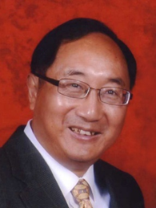
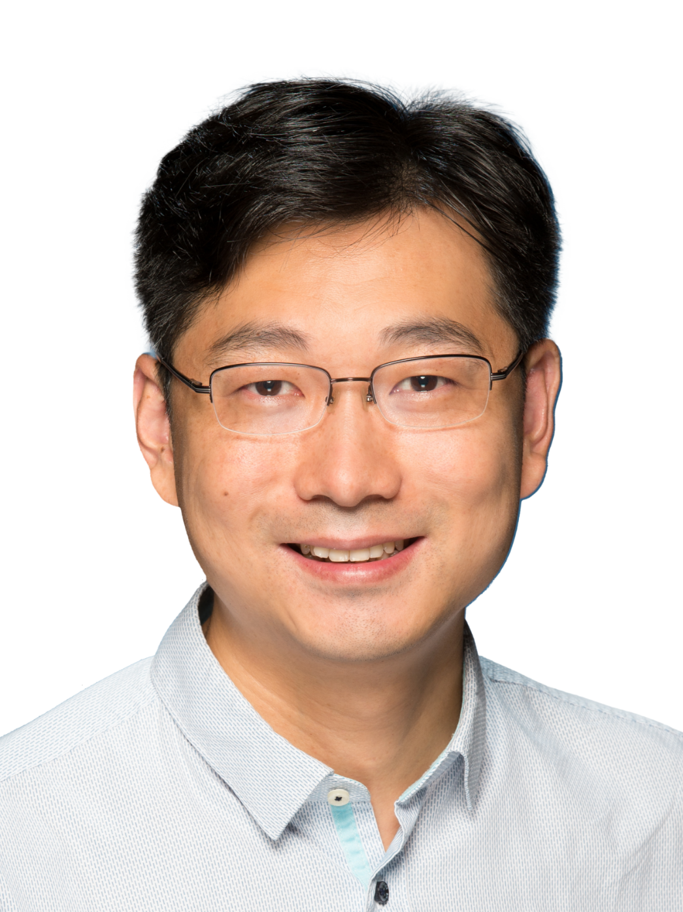
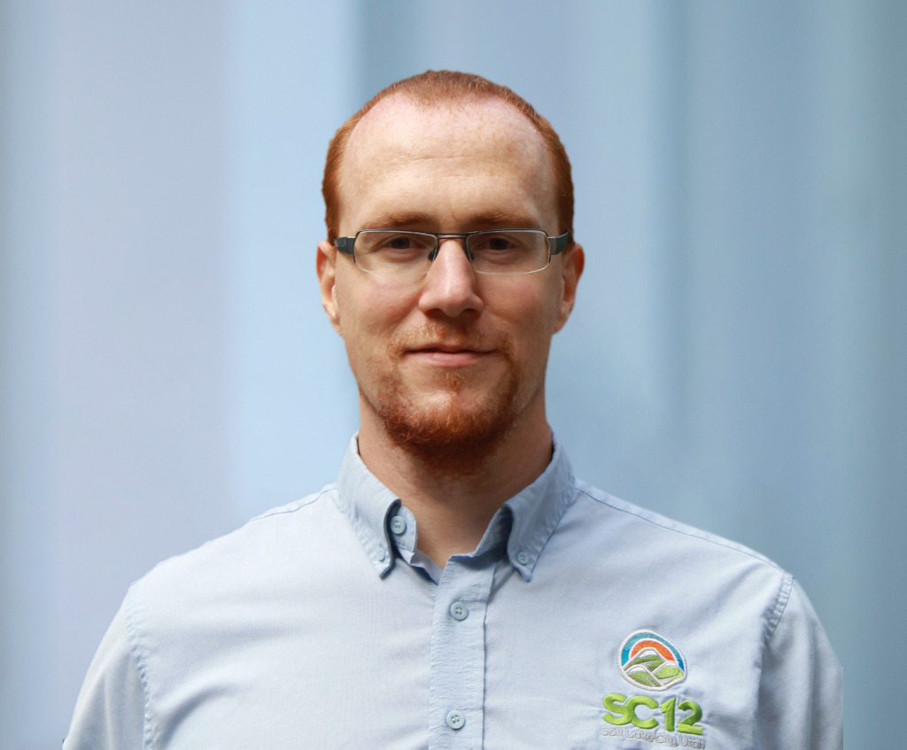
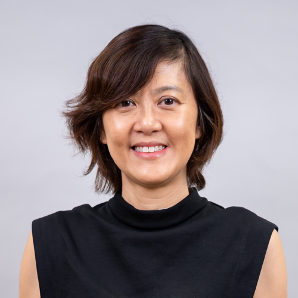

# Keynote Speakers

## **From Scalable Computing to the Scaling Law: A Reexamination of Parallel Processing**

    
    

        <h3 style="margin: 0;"><strong>Xian-He Sun</strong></h3>
        
Illinois Institute of Technology Chicago, USA

    

**Abstract:** AI’s recent success is driven by scaling laws, where increasing data and compute power yields predictably better accuracy. This trend demands computing systems that are infinitely scalable. This talk reevaluates parallel processing through both scale-out and scale-up lenses to address these AI-driven challenges. After reviewing foundational breakthroughs in the field, we present DataflowV (Dataflow under the von Neumann machine), a data-centric methodology that maximizes parallelism and concurrency from different aspects. We illustrate the DataflowV concept using two NSF-funded cyberinfrastructure systems: Hermes, for large-scale data handling, and ChronoLog, for application-specific AI-integrated optimizations. We conclude by introducing IOWrap, a data-management system tailored for the unique demands of modern AI agents.

**Bio:** Dr. **Xian-He Sun** is a University Distinguished Professor, the Ron Hochsprung Endowed Chair of Computer Science, and the director of the Gnosis Research Center for AI-driven data management at the Illinois Institute of Technology (Illinois Tech). Before joining Illinois Tech, he worked at DoE Ames National Laboratory, at ICASE, NASA Langley Research Center, at Louisiana State University, Baton Rouge, and was an ASEE fellow at Navy Research Laboratories. Dr. Sun is an IEEE fellow and is known for his memory-bounded speedup model, also called Sun-Ni’s Law, for scalable computing. His research interests include high-performance data management, memory and I/O systems, and performance evaluation and optimization. He has over 350 publications and 7 patents in these areas and is currently leading multiple large software development projects in high performance data management systems. Dr. Sun is the Editor-in-Chief of the IEEE Transactions on Parallel and Distributed Systems, and a former department chair of the Computer Science Department at Illinois Tech. He received the Golden Core award from IEEE CS society in 2017, the ACM Karsten Schwan Best Paper Award from ACM HPDC in 2019, and the first prize best paper award from ACM/IEEE CCGrid in 2021. More information about Dr. Sun can be found on his web site [http://www.cs.iit.edu/~sun/](http://www.cs.iit.edu/~sun/){:target="_blank"}.

----

## **Efficient LLM Serving via Compression-Centric Optimizations**

    
    

        <h3 style="margin: 0;"><strong>Xiaowen Chu</strong></h3>
        
The Hong Kong University of Science and Technology (Guangzhou) Guangzhou, China

    

**Abstract:** Large language model (LLM) serving is fundamentally constrained by GPU memory capacity and bandwidth. While model compression can alleviate these constraints, practical system-level speedups are frequently hindered by the computational overhead of decoding and data movement. This talk explores a compression-centric paradigm for efficient LLM serving, highlighting two synergistic systems: SpInfer and ZipServ. We demonstrate how hardware-aware format co-design bridges the gap between theoretical compression and practical acceleration. First, SpInfer optimizes sparsified LLM serving by redesigning sparse data structures to minimize indexing overhead, unlocking the efficiency of unstructured sparsity on GPUs. Second, ZipServ extends this philosophy to bit-exact inference via lossless compression, enabling on-the-fly decoding that strictly aligns with Tensor Core execution to eliminate redundant memory traffic. Ultimately, this talk illustrates that by co-designing compression formats and execution pipelines with GPU architectures, compression transitions from a mere storage-saving technique into a core systems-level optimization principle that simultaneously minimizes memory footprint and accelerates LLM inference.

**Bio:** Dr. **Xiaowen Chu** is a Full Professor and Acting Head of the Artificial Intelligence Thrust at The Hong Kong University of Science and Technology (Guangzhou). He has been the Acting Head and Head of Data Science and Analytics Thrust at HKUST(GZ) during 2023–2025. He received his Bachelor's degree from Tsinghua University and his Ph.D. from The Hong Kong University of Science and Technology. His research focuses on high-performance computing, machine learning systems, and distributed systems. He has received seven Best Paper Awards at international conferences, including EuroSys 2025 and INFOCOM 2021, and Distinguished Paper Award of ICDCS 2025. Dr. Chu has been recognized multiple times in the Stanford University World's Top 2% Scientists List. He serves (or has served) as an Associate Editor or Guest Editor for IEEE Transactions on Cloud Computing, IEEE Transactions on Network Science and Engineering, IEEE Internet of Things Journal, IEEE Transactions on Big Data, IEEE Network, and IEEE Transactions on Industrial Informatics. He has served as an area chair for NeurIPS, ICML, and ICLR. He was the TPC Co-Chair or General Co-Chair of IEEE MetaCom 2025, IEEE/ACM IWQoS 2024, BigCom 2023, IEEE GreenCom 2022, IEEE HPCC 2021, IEEE DSS 2020, EAI QShine 2019, etc. He is a Fellow of IEEE and AAIA.

----

## **Ultra Ethernet for next-generation AI and HPC workloads**

    
    

        <h3 style="margin: 0;"><strong>Torsten Hoefler</strong></h3>
        
ETH Zurich Zurich, Switzerland

    

**Abstract:** The Ultra Ethernet Consortium set out to redefine Ethernet-based interconnects for AI and high-performance computing (HPC), culminating in the recent release of its first specification (version 1.0). We will analyze HPC and AI workloads with respect to their networking requirements. We will continue by highlight key innovations that distinguish Ultra Ethernet from existing solutions, ranging from lossy operation—both with and without trimming—to fully hardware-offloaded rendezvous protocols. We will explore the architectural advancements and technical highlights that enhance efficiency, scalability, and performance, positioning Ultra Ethernet as a transformative force in next-generation computing. We will also discuss current experiences with data from real-world large-scale deployment running jobs on up to 75000 GPUs stably through many switch and link failures in the network.

**Bio:** Prof. **Torsten Hoefler** is a Professor of Computer Science at ETH Zurich, a member of Academia Europaea, and a Fellow of the ACM, IEEE, and ELLIS. He received the 2024 ACM Prize in Computing, one of the highest honors in the field. Following a “Performance as a Science” vision, he combines mathematical models of architectures and applications to design optimized computing systems. Before joining ETH Zurich, he led the performance modeling and simulation efforts for the first sustained Petascale supercomputer, Blue Waters, at the University of Illinois at Urbana-Champaign. He is also a key contributor to the Message Passing Interface (MPI) standard where he chaired the "Collective Operations and Topologies" working group. Torsten won best paper awards at his field's top conference ACM/IEEE Supercomputing in 2010, 2013, 2014, 2019, 2022, 2023, 2024, and at other international conferences. He has published numerous peer-reviewed scientific articles and authored chapters of the MPI-2.2 and MPI-3.0 standards. For his work, Torsten received the IEEE CS Sidney Fernbach Memorial Award in 2022, the ACM Gordon Bell Prize in 2019, the ACM Gordon Bell Prize in Climate Modeling in 2025, Germany's Max Planck-Humboldt Medal, the ISC Jack Dongarra award, the IEEE TCSC Award of Excellence (MCR), ETH Zurich's Latsis Prize, the SIAM SIAG/Supercomputing Junior Scientist Prize, the IEEE TCSC Young Achievers in Scalable Computing Award, and the BenchCouncil Rising Star Award. Following his Ph.D., he received the 2014 Young Alumni Award and the 2022 Distinguished Alumni Award of his alma mater, Indiana University. Torsten was elected to the first steering committee of ACM's SIGHPC in 2013 and he was re-elected for every term since then. He was the first European to receive many of those honors; he also received both an ERC Starting and Consolidator grant. His research interests revolve around the central topic of performance-centric system design and include scalable networks, parallel programming techniques, and performance modeling for large-scale simulations and artificial intelligence systems. More information about Prof. Hoefler can be found on his web site [https://htor.inf.ethz.ch/](https://htor.inf.ethz.ch/){:target="_blank"}.

----

## **Parallel computing on ultra-low-power chips**

    
    

        <h3 style="margin: 0;"><strong>Li-Shiuan Peh</strong></h3>
        
National University of Singapore Singapore

    

**Abstract:** This talk will discuss how parallel computing is making inroads into ultra-low-power chips. I will chronicle how the highly parallel architectures of supercomputers and servers that enabled scalable HPC have made their way into AI accelerators in data centers in recent years, and are moving further into edge devices to enable power-efficient chips that deliver high performance at mW. Next, I will walk through recent research into ultra-low-power AI accelerators and several of our chip prototypes targeting battery-powered edge devices. The talk will round off with a glimpse into how these chips can enable next-generation AI-powered wearables.

**Bio:** Prof. **Li-Shiuan Peh** joined NUS as Provost’s Chair Professor in the Department of Computer Science, with a courtesy appointment in the Department of Electrical and Computer Engineering in 2016. Previously, she was Professor of Electrical Engineering and Computer Science at MIT and was on the faculty of MIT since 2009. She was also the Associate Director for Outreach of the Singapore-MIT Alliance of Research & Technology (SMART) from 2015-2016. Prior to MIT, she was on the faculty of Princeton University from 2002. She graduated with a Ph.D. in Computer Science from Stanford University in 2001, and a B.S. in Computer Science from the National University of Singapore in 1995. Her research focuses on on-chip networks, low-power chips and systems. Her awards include IEEE Fellow in 2017, NRF Returning Singaporean Scientist Award in 2016, ACM Distinguished Scientist Award in 2011, MICRO Hall of Fame in 2011, CRA Anita Borg Early Career Award in 2007, Sloan Research Fellowship in 2006, and the NSF CAREER award in 2003. Her papers have received 4 test-of-time awards.

----

