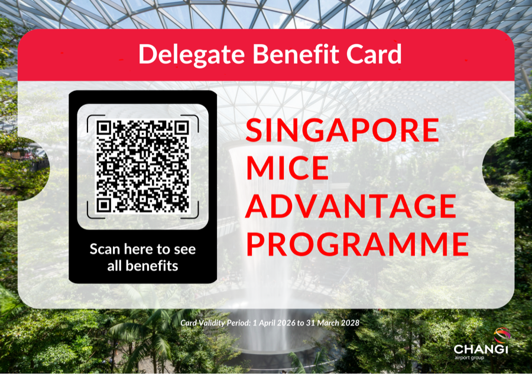

## Travel (How to Get There)

As mentioned in the [Venue](venue.md) page, ICPP 2026 will be held at **NTU@one-north**, in the heart of Singapore's one-north research and innovation district, conveniently located near Buona Vista MRT station.

> **NTU@one-north** 
> 11 Slim Barracks Rise 
> Singapore 138664

### From Changi Airport to NTU@one-north

Most international visitors arrive at [Changi Airport](https://www.changiairport.com/){:target="_blank"} (`SIN`). It is about a one-hour MRT ride or a 30-minute taxi ride (depending on traffic) from the conference venue.

!!! tip "Delegate benefits at Changi Airport"
    Changi Airport Group supports ICPP 2026 through the **Singapore MICE Advantage Programme (SMAP)**. As a delegate you can enjoy exclusive dining, shopping, experiences, and travel-essentials offers at Changi. Browse the full list and redemption instructions on the [SMAP benefits page](https://www.changiairport.com/en/prog/smap.html?utm_source=email&utm_medium=SMAP&utm_campaign=parallelprocessing2026){:target="_blank"}. Some offers require you to present the **Delegate Benefit Card** below (valid 1 April 2026 – 31 March 2028) — scan its QR code to see all benefits.

    { width="320" style="display:block;margin:0 auto" }

The most convenient and economical way to reach the venue is by **MRT** (Singapore's metro system). Take the train from **Changi Airport MRT Station (`CG2`)** to **Tanah Merah MRT Station (`EW4`)**, then transfer to the **East-West Line** (green) heading towards Tuas Link. Alight at **Buona Vista MRT Station (`EW21`)**. The whole journey takes roughly one hour.

!!! warning "Use Buona Vista, not one-north"
    Although the venue is in the *one-north* district, the **one-north MRT station** (Circle Line) is actually farther from the campus on foot. Always alight at **Buona Vista (`EW21`)**.

!!! tip "Staying at a conference hotel?"
    Guests of the recommended hotels — [Park Avenue Rochester and Citadines Connect Rochester / Citadines Science Park](accommodation.md) — should also alight at **Buona Vista MRT Station**, as these hotels are within easy reach of NTU@one-north.

Prefer to travel by taxi? A taxi from Changi Airport to NTU@one-north costs approximately **S$30–S$50**. Useful apps for getting around include [Grab](https://www.grab.com/sg/){:target="_blank"} (ride-hailing / taxi) and [Google Maps](https://www.google.com/maps){:target="_blank"} (navigation and live public-transit directions).

#### Travelling to the city centre instead

If you are heading to a hotel in the city centre first, you can stay on the **East-West Line** towards the city and alight at **City Hall (`EW13`)** or **Raffles Place (`EW14`)**. Alternatively, transfer to the **Downtown Line** at **Expo (`DT35`)** and alight at **Bayfront (`DT16`)**, **Downtown (`DT17`)**, or **Chinatown (`DT19`)**.

#### Paying for the MRT

You do **not** need to buy a ticket in advance. Tap in and out at the fare gates using any of the following:

- Contactless **Mastercard / Visa / American Express / NETS** bank cards
- Mobile wallets (Apple Pay, Google Pay, etc.)
- A stored-value **EZ-Link** or **NETS FlashPay** card
- The **Singapore Tourist Pass** (unlimited travel for a fixed number of days)

Single MRT trips typically cost around **S$1–2**. Foreign-issued Mastercard and Visa contactless cards incur a **S$0.60 administrative fee per day of use**, so frequent travellers may prefer a stored-value card or tourist pass. SimplyGo EZ-Link cards are available from SimplyGo Ticket Offices, including at selected MRT stations, and can be topped up through the SimplyGo app.

#### Useful Links

- [Getting around Changi Airport](https://www.changiairport.com/en/airport-guide/getting-to-from-the-airport.html){:target="_blank"}
- [LTA MRT system map](https://www.lta.gov.sg/content/ltagov/en/map/train.html){:target="_blank"}
- [LTA journey planning and payment information](https://www.lta.gov.sg/content/ltagov/en/getting_around/public_transport/plan_your_journey.html){:target="_blank"}
- [MyTransport.SG for iOS](https://itunes.apple.com/sg/app/mytransport-singapore/id1306661188?mt=8){:target="_blank"}
- [MyTransport.SG for Android](https://play.google.com/store/apps/details?id=sg.gov.lta.mytransportsg){:target="_blank"}
- [Singapore Tourist Pass](https://thesingaporetouristpass.com.sg/){:target="_blank"}
- [EZ-Link](https://www.ezlink.com.sg/){:target="_blank"}
- [Buying a SIM card at Changi Airport](https://www.changiairport.com/en/airport-guide/facilities-and-services/sim-cards.html){:target="_blank"}

### At NTU@one-north – Navigating the Venue

NTU@one-north is **less than a 10-minute walk** from Buona Vista MRT station, near the Star Vista shopping centre. On arrival at the campus, take the lift at **lift lobby 2** (or the escalator) to **level 3**, enter Alumni House, and turn left.

!!! note "Detailed floor directions coming soon"
    The location of the registration desk, room-level directions, and floor maps for ICPP 2026 will be provided closer to the event. In the meantime, see the [Venue](venue.md) page for more details about the campus.
